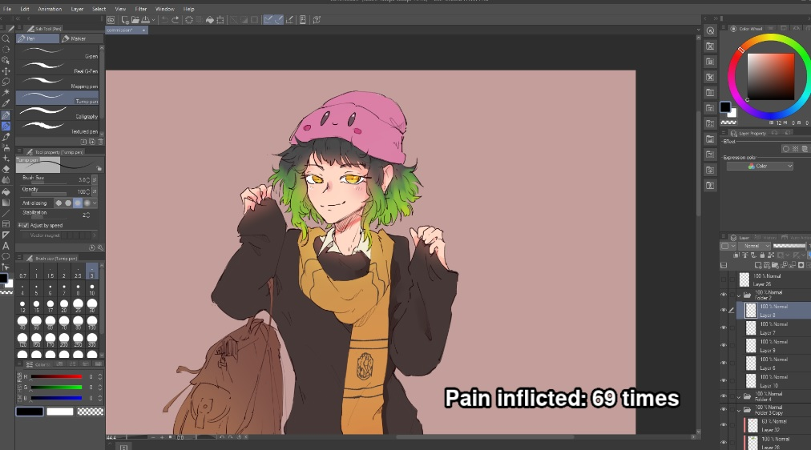

# undo-tracker

Small program made for art streamers on [Twitch](https://www.twitch.tv/)
it tracks how many times CTRL+Z has been pressed and allows them to display
it on their twitch stream through a small chroma keyable SDL window (see screenshots below)

Inspired by: [Clip studio pain undo tracker](https://github.com/dotboris/clip-studio-pain-undo-tracker)

## Installation

Unpack `undo-tracker.zip` to a folder of your choice and run `undo-tracker.exe`
(You can find `undo-tracker.zip` in this project's releases on the right side)

### Instructions
    
Do not minimize the program, make sure it's running in the background somewhere, be it 
your other monitor or just 'behind' your main drawing program, otherwise it will not 
count correctly (or at all) until restored again (it still keeps track of your undos, it just won't 
update the text). This does NOT apply when reading from `undos-counted.txt` text file created by the
program at the start.

Reading from text file allows for more customization BUT your undos will be updating (visually) a little bit slower
since OBS has to read the contents for the file itself, store it and then display it (as opposed to just capturing
the contents of a window application).

In case you delete the `undos-counted.txt` text file, you can press CTRL + Z again, the file will be
recreated with your current "undos count".
    
## Build

The project mainly targets Windows OS (possible change in the future) so you need MSVC compiler `cl.exe`

Set the path to your visual studio's `vcvars64.bat` script in build.bat then run `build.bat` script
from console:

```console
> build
```

after that all files necessary to run the program are in `./build` directory, you can run the program
from there:

```console
> undo-tracker.exe
```

## Screenshots

